# 🚀 Astra — AI-Powered Documentation Chatbot Platform

> Transform your documentation into an intelligent conversational interface. Astra makes it easy to add AI-powered Q&A to your docs with a beautiful, embeddable widget.

[](LICENSE)
[](https://fastapi.tiangolo.com/)
[](https://nextjs.org/)
[](https://react.dev/)

## ✨ What is Astra?

Astra is a complete platform for building intelligent chatbots that understand your documentation. It combines web scraping, vector embeddings, and retrieval-augmented generation (RAG) to create chatbots that accurately answer questions using only your content.

### 🎯 Key Features

* **One-Time Indexing** — Crawl and embed documentation once, reuse across conversations
* **Embeddable Widget** — Drop-in React component with a polished UI
* **Fully Customizable** — Clerk-style appearance API for deep theming control
* **High Performance** — Qdrant-backed vector search for low-latency retrieval
* **Framework Agnostic** — Works with Next.js, Vite, CRA, Remix, and more
* **Persistent Storage** — Embeddings and metadata survive restarts
* **Isolated Crawls** — Multiple documentation sites remain fully separated

## 📦 Project Structure

```
technex-hackathon/
├── backend/          # FastAPI backend with RAG pipeline
├── frontend/         # Next.js dashboard for managing crawls
├── widget/           # Embeddable React chatbot component
└── extension/        # Browser extension (optional)
```

### Backend

* **Tech Stack**: FastAPI, Python
* **Features**: FireCrawl scraping, Hugging Face embeddings, Qdrant storage, Gemini RAG
* **Docs**: `backend/README.md`

### Frontend

* **Tech Stack**: Next.js 16, React 19, TailwindCSS, shadcn/ui
* **Features**: Crawl management, chat sessions, analytics
* **Docs**: `frontend/README.md`

### Widget

* **Tech Stack**: React, TypeScript, Vanilla CSS
* **Features**: Fully embeddable, appearance-driven chatbot UI
* **Docs**: `widget/README.md`

### Extension

* **Tech Stack**: React, Vite
* **Features**: Browser-level access to Astra
* **Docs**: `extension/README.md`

## 🚀 Quick Start

### Prerequisites

* Node.js 20+
* Python 3.8+
* Docker (for Qdrant)

### Clone the Repository

```bash
git clone https://github.com/SaptanshuHackathons/technex-hackathon.git
cd technex-hackathon
```

### Backend Setup

```bash
cd backend
pip install -r requirements.txt
cp .env.example .env
docker-compose up -d qdrant
uvicorn main:app --reload --host 0.0.0.0 --port 8000
```

Backend runs at `http://localhost:8000`.

### Frontend (Optional)

```bash
cd frontend
npm install
npm run dev
```

Frontend runs at `http://localhost:3000`.

## 💡 Usage Examples

### Embed the Widget

```tsx
<AstraWidget
  siteId="my-docs"
  apiKey="astra_your_key"
  pages={[
    { url: 'https://docs.example.com/', label: 'Home' },
    { url: 'https://docs.example.com/api', label: 'API' },
  ]}
  appearance={{
    variables: {
      primaryColor: '#10b981',
      fontFamily: 'Inter, sans-serif',
    }
  }}
/>
```

### Crawl Documentation

```bash
curl -X POST http://localhost:8000/api/scrape \
  -H "Content-Type: application/json" \
  -d '{"url":"https://docs.example.com","max_depth":3}'
```

### Query the Chatbot

```bash
curl -X POST http://localhost:8000/api/query \
  -H "Content-Type: application/json" \
  -d '{"query":"How do I get started?","chat_id":"your-chat-id"}'
```

## 🏗️ Architecture

```mermaid
graph TB
    User[👤 User] -->|Interacts with| Widget[🎨 Astra Widget]
    Widget -->|API Requests| Backend[⚡ FastAPI Backend]
    Backend -->|Scrapes| FireCrawl[🔥 FireCrawl API]
    Backend -->|Embeddings| HF[🤗 Hugging Face]
    Backend -->|Vector Search| Qdrant[🗄️ Qdrant]
    Backend -->|RAG| Gemini[✨ Google Gemini]
    Dashboard[📊 Dashboard] --> Backend
```



### How It Works

1. Crawl documentation using FireCrawl
2. Generate embeddings via Hugging Face
3. Store vectors in Qdrant
4. Retrieve relevant chunks on query
5. Generate answers with Google Gemini

## 🛠️ API Documentation

* Swagger: [http://localhost:8000/docs](http://localhost:8000/docs)
* ReDoc: [http://localhost:8000/redoc](http://localhost:8000/redoc)

## 📊 Tech Stack

**Backend**: FastAPI, FireCrawl, Hugging Face, Qdrant, Google Gemini
**Frontend**: Next.js, React, TailwindCSS, shadcn/ui
**Widget**: React, TypeScript, Vanilla CSS

If you want, I can also:

* tune emoji density for **GitHub vs Devpost**
* make a **no-emoji enterprise version**
* align tone for **judges vs OSS maintainers**
