# 🚀 Astra - AI-Powered Documentation Chatbot Platform

> Transform your documentation into an intelligent conversational interface. Astra makes it easy to add AI-powered Q&A to your docs with a beautiful, embeddable widget.

[](LICENSE)
[](https://fastapi.tiangolo.com/)
[](https://nextjs.org/)
[](https://react.dev/)

## ✨ What is Astra?

Astra is a complete platform for building intelligent chatbots that understand your documentation. It combines web scraping, vector embeddings, and retrieval-augmented generation (RAG) to create chatbots that can accurately answer questions about your content.

### 🎯 Key Features

- **🤖 Smart RAG System** - Uses Google Gemini and semantic search to provide accurate, context-aware answers
- **📚 One-Time Indexing** - Crawl and embed your docs once, reuse for all conversations
- **🎨 Beautiful Embeddable Widget** - Drop-in React component with stunning UI
- **🔧 Fully Customizable** - Clerk-like appearance API for complete theming control
- **⚡ Blazing Fast** - Powered by Qdrant vector database for lightning-fast retrieval
- **🌐 Framework Agnostic** - Works with Next.js, Vite, CRA, Remix, and more
- **💾 Persistent Storage** - All data and embeddings persist across restarts
- **🔒 Isolated Crawls** - Keep different documentation sites completely separate

## 📦 Project Structure

This monorepo contains four main components:

```
technex-hackathon/
├── backend/          # FastAPI backend with RAG pipeline
├── frontend/         # Next.js dashboard for managing crawls
├── widget/          # Embeddable React chatbot component
└── extension/       # Browser extension (optional)
```

### Backend
- **Tech Stack**: FastAPI, Python
- **Features**: Web scraping (FireCrawl), embeddings (Hugging Face), vector storage (Qdrant), RAG (Google Gemini)
- **Docs**: See [backend/README.md](backend/README.md)

### Frontend  
- **Tech Stack**: Next.js 16, React 19, TailwindCSS, shadcn/ui
- **Features**: Dashboard for managing crawls, chat sessions, and analytics
- **Docs**: See [frontend/README.md](frontend/README.md)

### Widget
- **Tech Stack**: React, TypeScript, Vanilla CSS
- **Features**: Embeddable chatbot widget with full customization support
- **Docs**: See [widget/README.md](widget/README.md)

### Extension
- **Tech Stack**: React, Vite
- **Features**: Browser extension for quick access to Astra
- **Docs**: See [extension/README.md](extension/README.md)

## 🚀 Quick Start

### Prerequisites

- **Node.js** 20+ and npm
- **Python** 3.8+
- **Docker** (for Qdrant vector database)

### 1. Clone the Repository

```bash
git clone https://github.com/SaptanshuHackathons/technex-hackathon.git
cd technex-hackathon
```

### 2. Set Up Backend

```bash
cd backend

# Install Python dependencies
pip install -r requirements.txt

# Copy environment template
cp .env.example .env

# Edit .env with your API keys:
# - FIRECRAWL_API_KEY (get from https://firecrawl.dev)
# - GOOGLE_API_KEY (get from https://makersuite.google.com)
# - HUGGINGFACE_API_KEY (get from https://huggingface.co)

# Start Qdrant with persistence
docker-compose up -d qdrant

# Start backend server
uvicorn main:app --reload --host 0.0.0.0 --port 8000
```

The backend will be available at `http://localhost:8000`

### 3. Set Up Frontend (Optional)

```bash
cd frontend

# Install dependencies
npm install

# Start development server
npm run dev
```

The frontend will be available at `http://localhost:3000`

### 4. Use the Widget

```bash
cd widget

# Install dependencies
npm install

# Copy widget files to your project or use in place
```

See [widget/README.md](widget/README.md) for detailed integration instructions.

## 💡 Usage Examples

### Embed the Widget in Your Docs

```tsx
import AstraWidget from './widget';

function DocsPage() {
  return (
    <div>
      <AstraWidget
        siteId="my-docs"
        apiKey="astra_your_key"
        pages={[
          { url: 'https://docs.example.com/', label: 'Home' },
          { url: 'https://docs.example.com/api', label: 'API' },
        ]}
        appearance={{
          variables: {
            primaryColor: '#10b981',
            fontFamily: 'Inter, sans-serif',
          }
        }}
      />
    </div>
  );
}
```

### Crawl and Index Documentation

```bash
curl -X POST http://localhost:8000/api/scrape \
  -H "Content-Type: application/json" \
  -d '{
    "url": "https://docs.example.com",
    "max_depth": 3
  }'
```

### Query the Chatbot

```bash
curl -X POST http://localhost:8000/api/query \
  -H "Content-Type: application/json" \
  -d '{
    "query": "How do I get started?",
    "chat_id": "your-chat-id"
  }'
```

## 🏗️ Architecture

```mermaid
graph TB
    User[👤 User] -->|Interacts with| Widget[🎨 Astra Widget]
    Widget -->|API Requests| Backend[⚡ FastAPI Backend]
    Backend -->|Scrapes| FireCrawl[🔥 FireCrawl API]
    FireCrawl -->|Returns HTML/Markdown| Backend
    Backend -->|Generate Embeddings| HF[🤗 Hugging Face API]
    HF -->|Returns Vectors| Backend
    Backend -->|Store/Query Vectors| Qdrant[🗄️ Qdrant Vector DB]
    Backend -->|Generate Answers| Gemini[✨ Google Gemini]
    Gemini -->|Returns AI Response| Backend
    Backend -->|Chat Response| Widget
    
    Dashboard[📊 Next.js Dashboard] -->|Manage| Backend
    
    style Widget fill:#61DAFB,stroke:#333,stroke-width:2px,color:#000
    style Backend fill:#009688,stroke:#333,stroke-width:2px,color:#fff
    style Qdrant fill:#DC244C,stroke:#333,stroke-width:2px,color:#fff
    style Gemini fill:#4285F4,stroke:#333,stroke-width:2px,color:#fff
```



### How It Works

1. **📄 Crawl**: FireCrawl scrapes your documentation and converts it to markdown
2. **🧮 Embed**: Hugging Face generates vector embeddings from the content
3. **💾 Store**: Qdrant stores embeddings for fast semantic search
4. **💬 Chat**: Users ask questions via the widget
5. **🔍 Retrieve**: Most relevant content chunks are found using vector similarity
6. **✨ Generate**: Google Gemini creates natural answers using retrieved context

## 🛠️ API Documentation

Once the backend is running, explore the interactive API docs:

- **Swagger UI**: http://localhost:8000/docs
- **ReDoc**: http://localhost:8000/redoc

### Key Endpoints

| Endpoint | Method | Description |
|----------|--------|-------------|
| `/api/scrape` | POST | Crawl and index a website |
| `/api/chats` | POST | Create a new chat session |
| `/api/query` | POST | Ask a question to the chatbot |
| `/api/pages` | GET | List all crawled pages |
| `/api/crawls` | GET | List all crawl sessions |

## 🎨 Customization

### Theme the Widget

```tsx
<AstraWidget
  appearance={{
    variables: {
      primaryColor: '#6366f1',
      primaryHover: '#4f46e5',
      fontFamily: 'Outfit, sans-serif',
      borderRadius: '12px',
      accentColor: '#ec4899',
    },
    elements: {
      window: 'shadow-2xl',
      messageBubble: 'rounded-2xl',
    }
  }}
/>
```

### Build Custom UI

```tsx
<AstraWidget.Root apiKey="your-key">
  <AstraWidget.Toggle />
  <AstraWidget.Window>
    <AstraWidget.Messages />
    <AstraWidget.Input />
    <AstraWidget.Footer />
  </AstraWidget.Window>
</AstraWidget.Root>
```

## 📊 Tech Stack

### Backend
- **FastAPI** - Modern Python web framework
- **FireCrawl** - Web scraping and crawling
- **Hugging Face** - Embedding generation (BAAI/bge-m3)
- **Qdrant** - Vector database for semantic search
- **Google Gemini** - LLM for answer generation
- **Supabase** - Optional data persistence

### Frontend
- **Next.js 16** - React framework
- **React 19** - UI library
- **TailwindCSS 4** - Utility-first CSS
- **shadcn/ui** - Beautiful UI components
- **Zustand** - State management
- **Framer Motion** - Animations

### Widget
- **React** - Component library
- **TypeScript** - Type safety
- **Vanilla CSS** - Zero dependencies

## 🔐 Environment Variables

### Backend (.env)

```env
# Required
FIRECRAWL_API_KEY=fc-xxx
GOOGLE_API_KEY=AIzaSy-xxx
HUGGINGFACE_API_KEY=hf_xxx

# Optional
QDRANT_URL=http://localhost:6333
EMBEDDING_MODEL_NAME=BAAI/bge-m3
```

### Frontend (.env.local)

```env
NEXT_PUBLIC_API_URL=http://localhost:8000
```

## 📝 License

This project is licensed under the MIT License - see the [LICENSE](LICENSE) file for details.

## 🤝 Contributing

Contributions are welcome! Please feel free to submit a Pull Request.

1. Fork the repository
2. Create your feature branch (`git checkout -b feature/AmazingFeature`)
3. Commit your changes (`git commit -m 'Add some AmazingFeature'`)
4. Push to the branch (`git push origin feature/AmazingFeature`)
5. Open a Pull Request

## 🙏 Acknowledgments

- [FireCrawl](https://firecrawl.dev) - Web scraping infrastructure
- [Qdrant](https://qdrant.tech) - Vector similarity search engine
- [Google Gemini](https://deepmind.google/technologies/gemini/) - Large language model
- [Hugging Face](https://huggingface.co) - ML model hosting
- [shadcn/ui](https://ui.shadcn.com) - Beautiful UI components

## 📧 Contact

For questions or support, please open an issue on GitHub.

---

<div align="center">
Made with ❤️ for Technex Hackathon
</div>
